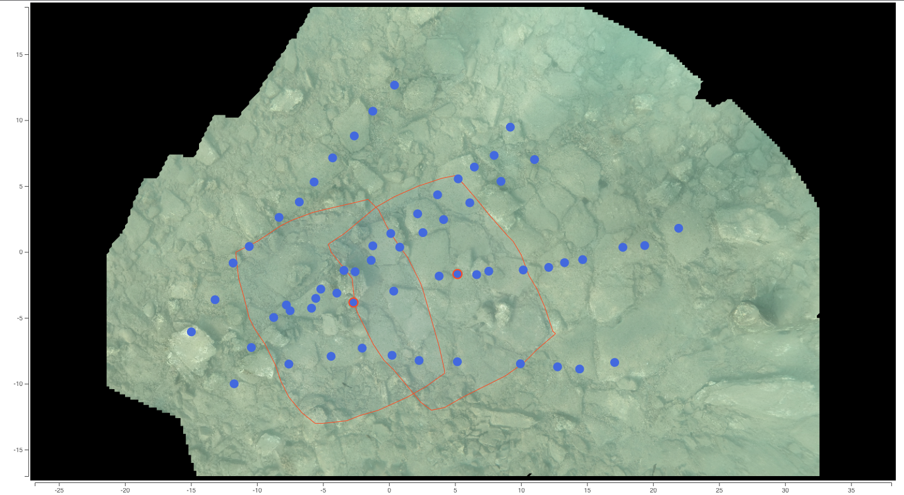

# OpenDroneMap - A shot coverage report

From an [OpenDronMap](https://www.opendronemap.org/) reconstruction, our goal is to see which part of the orthophoto is
covered by each shot.

We propose a web app with the orthophoto and camera positions displayed. Clicking on photo displays the covered area.



## How does it work?

From an OpenDroneMap reconstruction (odm by default), the reports needs access to the files stored in the project
directory:

````
cameras.json
images/*
odm_report/shots.geojson
odm_orthophoto/odm_orthophoto.tif
odm_orthophoto/odm_orthophoto_corners.txt
odm_texturing_25d/odm_textured_model_geo.obj
````

The reporting tool `odm-report-shot-coverage.py` creates a directory `odm_report/shot_coverage` with a web
page (`index.html`) containing the interactive report.

### Browsing through the results

Open the `odm_report/shot_coverage/index.html` file and mouse over the shot position (blue dots) to see the image.
Click on one or more shot to display the ground boundaries.

### Limitations
The shot boundaries are estimated based on the shot position and rotation, and the 2.5d model, but without ray tracing.
Therefore, The extent of the shot boundaries is projected behind a higher structure.

Our purpose was at first to tackle rather flat area, shot from above. Therefore, this limitation is not a big deal in such situations.

## Author

Alexandre Masselot (alexandre.masselot@gmail.com), with the help of the vibrant ODM community.

## License
MIT

